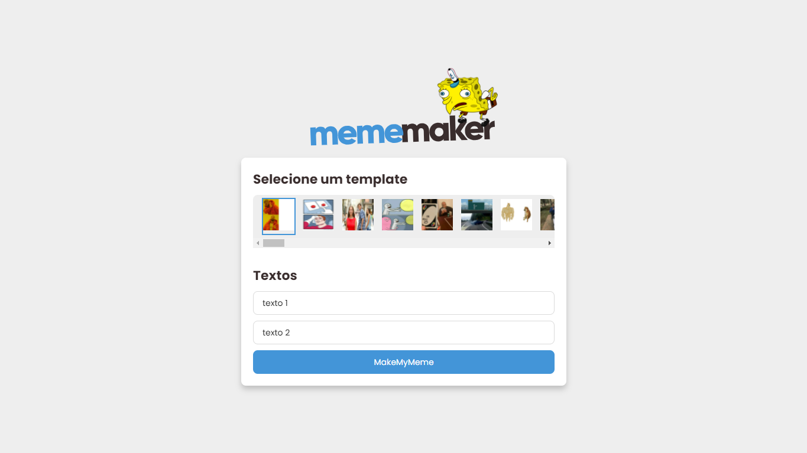

<p align="center">
  <a href="https://mememaker-iamdevmarcos.vercel.app/" target="_blank">
    
  </a>
</p>

# meme maker

> meme generator in **React** and **Styled Components**.

## Technology stack

- **Frontend:** [React.Js](https://reactjs.org/)
- **Deployment:** [Vercel](https://vercel.com/)
- **Build:** [Vite](https://vitejs.dev/)

## Test Online

[Click Here](https://mememaker-iamdevmarcos.vercel.app/)

## Running locally

1. Clone this repo:

```sh
$ git clone https://github.com/iamdevmarcos/mememaker.git
```

2. Then go to the project's folder:

```sh
cd mememaker
```

3. Install all dependencies:

```sh
npm install
```

4. Run locally:

```sh
npm run dev
```

## Autor

| [<br><sub>@iamdevmarcos</sub>](https://github.com/iamdevmarcos) |
